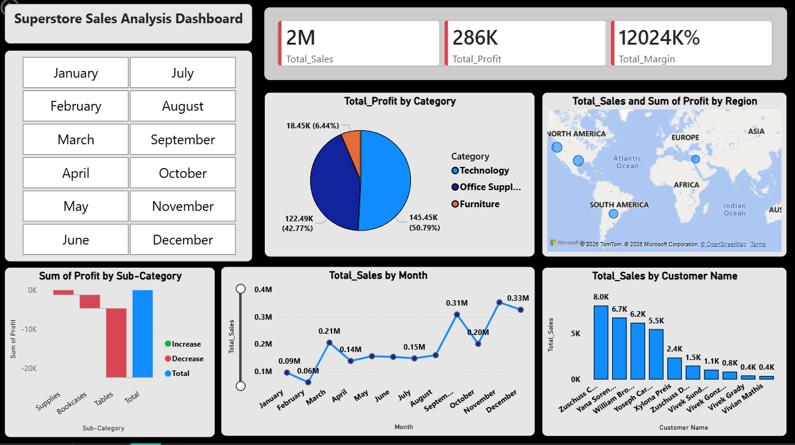

# 📊 Superstore Sales Analysis Dashboard

## 📌 Project Overview
This project presents an end-to-end sales analysis using Python, MySQL, and Power BI. The goal was to analyze sales trends, profitability, and regional performance using real business data.

## 📷 Dashboard Preview

## 🛠 Tools & Technologies
- Python (Pandas, Data Cleaning)
- MySQL (Data Analysis & Querying)
- Power BI (Dashboard & DAX)
- GitHub (Version Control)

## 📊 Dashboard Features
- KPI Cards (Total Sales, Profit, Margin)
- Category-wise Profit Analysis
- Regional Sales Distribution
- Monthly Sales Trend
- Top Customer Analysis
- Interactive Filters (Month, Region)

## 🔍 Key Insights
- Technology category generated the highest profit.
- West region showed the strongest sales performance.
- Sales peaked during November and December.
- Furniture category had lower profit margins.

## 📂 Project Structure
- Data Cleaning Notebook
- SQL Analysis File
- Power BI Dashboard (.pbix)
- Cleaned Dataset (.csv)

## 🚀 Author
**Jatin Tanwani**
